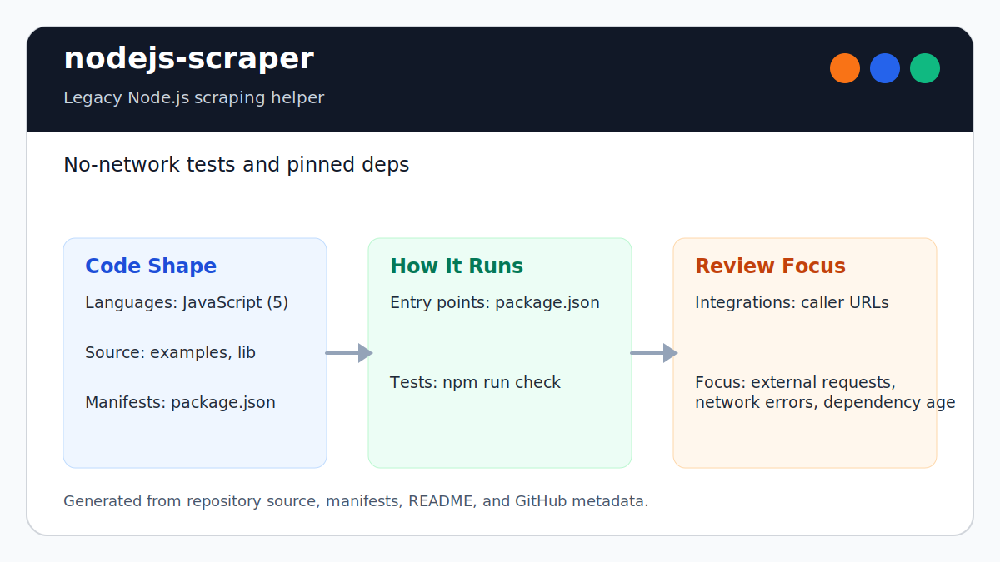

# nodejs-scraper

<!-- README-OVERVIEW-IMAGE -->


## Overview

`garethpaul/nodejs-scraper` is a legacy Node.js scraping helper that fetches
pages and exposes a jQuery-like document interface.

This README is based on the checked-in source, manifests, scripts, and repository metadata on the `master` branch. The project language mix found during review was: JavaScript (5).

## Repository Contents

- `README.md` - project overview and local usage notes
- `package.json` - JavaScript dependency and script metadata
- `CHANGES.md` - baseline change log
- `Makefile` - local verification entry point
- `examples` - source or example code
- `lib` - source or example code
- `SECURITY.md` - security reporting and disclosure guidance
- `VISION.md` - project direction and maintenance guardrails
- `docs/plans/2026-06-08-scraper-baseline.md` - completed hardening plan
- `scripts/check-baseline.py` - static baseline checks used by `npm run check`
- `test/scraper.test.js` - no-network behavior tests

Additional scan context:

- Source directories: examples, lib
- Dependency and build manifests: package.json
- Entry points or build surfaces: package.json
- Test-looking files: examples/test.js

## Getting Started

### Prerequisites

- Git
- Node.js and npm

### Setup

```bash
git clone https://github.com/garethpaul/nodejs-scraper.git
cd nodejs-scraper
npm install
make lint
make test
make build
make check
npm run check
```

The setup commands above are derived from repository files. Legacy mobile, Python, or JavaScript samples may require older SDKs or package versions than a modern workstation uses by default.
This package intentionally pins a legacy `request/jsdom` pair because the
current scraper API depends on old jsdom helpers. Treat `npm install` as a
legacy-runtime workflow until the jsdom integration is modernized.
The manifest declares `node >=6` to match the pinned `request` package.

## Running or Using the Project

- Import `scraper` from `lib/scraper.js` or use the package entry point.
- Pass a URL string, request options object, or array of either form.
- Request URIs must be HTTP(S); non-web schemes are rejected before the request
  client is called.
- HTTP(S) hosts are required, so malformed URLs like `http://` are rejected
  before the request client is called.
- HTTP(S) URI credentials are rejected, so `user:pass@host` targets do not
  reach the request client.
- Caller-provided request and fetch option objects are not mutated while
  defaults are applied.
- Non-object headers are ignored during request option normalization, while the
  default `User-Agent` header is retained.
- The header injection guard drops caller-provided header names or values that
  contain CR/LF characters before dispatch.
- Missing or non-function callbacks are treated as no-ops.
- The checked-in external examples use reserved `example.test` URLs; replace
  them with targets you own or have permission to test.
- Example scripts import `../lib/scraper` so they can run from this checkout.
- Use `reqPerSec` when issuing multiple external requests so callers do not
  overwhelm target services.
- Non-positive `reqPerSec` values are treated as unthrottled so the request
  queue still drains.

## Testing and Verification

- `npm test`
- `npm run check`
- `make lint`
- `make test`
- `make build`
- `make check`
- Pinned `ubuntu-24.04` GitHub Actions runs the dependency-injected tests and
  static baseline without `npm install`, external requests, or live scraping.

When the required SDK or runtime is unavailable, use static checks and source review first, then verify on a machine that has the matching platform toolchain.

## Configuration and Secrets

- No required secret or credential file was identified in the repository scan.
- Keep credentials, private target URLs, captured pages, and environment files
  out of git.

## Security and Privacy Notes

- Review changes touching external API calls or credential-adjacent configuration; examples from the scan include examples/advanced.js, examples/parallel.js, examples/simple.js.
- Review changes touching network requests, sockets, or service endpoints; examples from the scan include examples/advanced.js, examples/parallel.js, examples/simple.js, examples/test.js, and 1 more.
- Tests should avoid external requests by injecting fake request/jsdom
  dependencies. Network errors should be surfaced to callbacks without reading
  missing response bodies, non-function callbacks should not throw during async
  completion, non-object headers should not create numeric header names, and
  option defaults should not mutate caller inputs. HTTP(S) URI validation should
  reject non-web schemes, missing HTTP(S) hosts, and HTTP(S) URI credentials
  before request dispatch.
- The header injection guard should keep unsafe CR/LF header names and values
  out of normalized request options.
- Scraping workflows should respect robots guidance, terms of service, and
  rate limits.
- Treat non-positive `reqPerSec` values as a caller mistake rather than a
  queue-stalling throttle.

## Maintenance Notes

- See `SECURITY.md` for vulnerability reporting and safe research guidance.
- Run `npm run check`, `make lint`, `make test`, `make build`, and
  `make check` before changing scraper behavior, request handling, or examples.
- See `docs/plans/2026-06-09-make-gate-aliases.md` for the local verification
  gate aliases.
- See `docs/plans/2026-06-10-header-injection-guard.md` for the header
  injection guard.
- Keep `request/jsdom` changes explicit and tested because modern jsdom removed
  the APIs used by this package.
- See `VISION.md` for project direction and contribution guardrails.

## Contributing

Keep changes small and tied to the project that is already present in this repository. For code changes, document the toolchain used, avoid committing generated dependency directories or local configuration, and update this README when setup or verification steps change.
